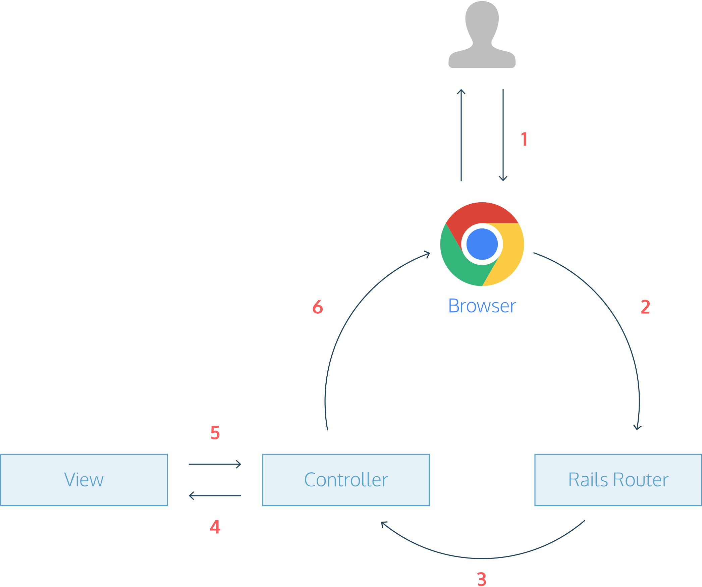

#### Learn

### Getting Started

## Controller

**2 min**

What happens when you visit `http://localhost:4001` in the browser? <br>
Check out the diagram in the browser by scrolling down to the **How it Works** section.

1. The browser makes a _request_ for the URL `http://localhost:4001`.
2. The request hits the Rails _router_ in **config/routes.rb**.
   The router recognizes the URL and sends the request to the _controller_.
3. The controller receives the request and processes it.
4. The controller passes the request to the _view_.
5. The view renders the page as HTML.
6. The controller sends the HTML back to the browser for you to see.

This is called the **request/response cycle**.
It’s a useful way to see how the [files](https://www.codecademy.com/resources/docs/ruby/files)
and folders of a Rails app fit together.

#### Instructions

1. **Looking at the request/response cycle, we need three parts to build a Rails app:**

   - A controller
   - A route
   - And a view

   Let’s start here by creating a controller.

   In the terminal, type:

   ```bash
   rails generate controller Pages
   ```

2. **After `rails generate` finishes running, in the Code Editor, open `app/controllers/pages_controller.rb`. Within the class `PagesController`, add a method `home`:**

   ```ruby
   class PagesController < ApplicationController
      def home
      end
   end
   ```

   Press the **Run** button to test your code! We’ll see what happened in the next exercise.

### Request-Response Cycle I

Guide for navigating a Rails app with static pages.

#### Background

When developing a Rails app, the **request/response cycle** is a useful guide to see how all the app’s files and folders fit together. The request/response cycle traces how a user’s request flows through the app. Understanding the request/response cycle is helpful to figure out which files to edit when developing an app (and where to look when things aren’t working).

#### How it Works



1. A user opens their browser, types in a URL, and presses Enter.
2. When a user presses Enter, the browser makes a request for that URL.
3. The request hits the Rails router (**config/routes.rb**). The router maps the URL to the correct controller and action to handle the request.
4. The action receives the request and passes it on to the view.
5. The view renders the page as HTML.
6. The controller sends the HTML back to the browser. The page loads and the user sees it.

In this way, the request/response cycle is a useful way to see what a Rails app’s files and folders are for and how they fit together.
