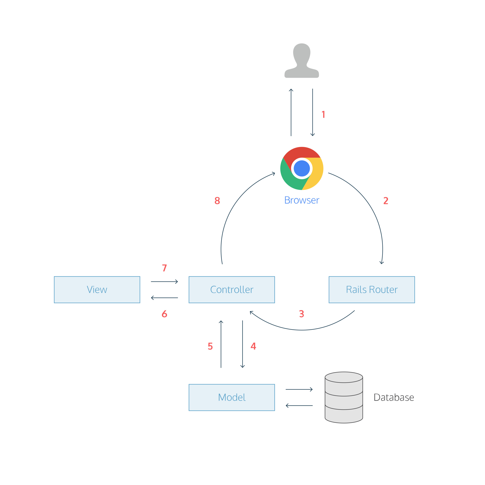

#### Learn

### SAVING DATA

## Request/Response Cycle

**2 min**

So far we’ve built a Rails app containing a static page. <br>
To do this, we used a controller, a route, and a view. <br>
The [request/response cycle](https://www.codecademy.com/articles/request-response-cycle-static) summarizes how these three parts work together.

However, a Rails app with static pages looks the same for all users. <br>
How can we create apps that save information? We do this with a database. <br>
Here’s how a database fits into the request-response cycle. <br>
Check out the diagram in the browser.

1. When you type `http://localhost:4001/welcome`, the browser makes a request for the URL `/welcome`. <br>
2. The request hits the Rails router.
3. The router maps the URL to a controller action to handle the request. <br>
4. The controller action receives the request, and asks the model to fetch data from the database. <br>
5. The model returns data to the controller action.
6. The controller action passes the data on to the view. <br>
7. The view renders the page as HTML.
8. The controller sends the HTML back to the browser.

#### Instructions

1. Let’s see how to incorporate a database by building a Rails app for a messaging service.

   Start by creating a new Rails app named `MessengerApp`.

   ```ruby
   rails new MessengerApp
   ```

2. Next, change directories to your new web app.

   ```bash
   cd MessengerApp
   ```

3. Install the gems in **Gemfile**.

   ```bash
   bundle install
   ```

4. Boot up the local Ruby on Rails server using the command `rails server` and view the app at `http://localhost:4001`. <br>
   You should see the Ruby on Rails logo.

   ```ruby
   rails server
   ```

### Request-Response Cycle II

Guide for navigating a dynamic Rails app.

#### Background

When developing a [Rails](https://www.codecademy.com/resources/blog/what-is-ruby-on-rails/) app,
the **request/response cycle** is a useful guide to see how all the app’s files and folders fit together. <br>
The request/response cycle traces how a user’s request flows through the app. <br>
Understanding the request/response cycle is helpful to figure out which files to edit when developing an app (and where to look when things aren’t working).

#### How it Works



1. A user opens their browser, types in a URL, and presses Enter.
   When a user presses Enter, the browser makes a request for that URL.
2. The request hits the Rails router (**config/routes.rb**).
3. The router maps the URL to the correct controller and action to handle the request.
4. The action receives the request, and asks the model to fetch data from the database.
5. The model returns a list of data to the controller action.
6. The controller action passes the data on to the view.
7. The view renders the page as HTML.
8. The controller sends the HTML back to the browser. The page loads and the user sees it.

In this way, the request/response cycle is a useful way to see how a Rails app’s files and folders are for and how they fit together.
