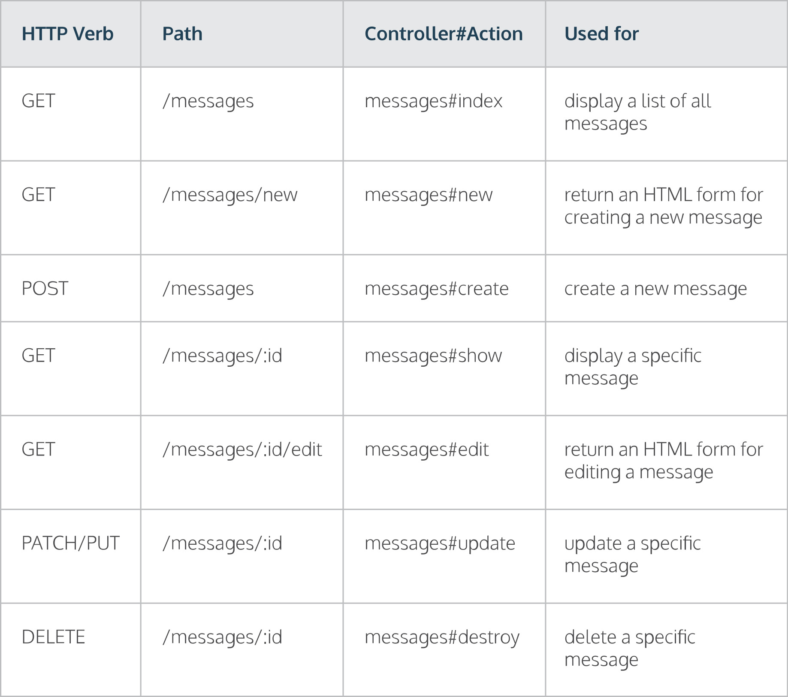

## Standard Controller Actions

Guide for Rails' seven standard controller actions used for displaying and modifying data.

[Ruby on Rails](https://www.codecademy.com/resources/blog/what-is-ruby-on-rails/) defines seven standard controller actions can be used to do common things such as display and modify data.



If you want to create routes for all seven actions in your app, you can add a <i>resource</i> route to your routes file. <br>
This resource route below maps URLs to the Messages controller’s seven actions (`index`, `show`, `new`, `create`, `edit`, `update`, and `destroy`):

```ruby
resources :messages
```

If you only want to create routes for specific actions, you can use :only to fine tune the resource route. <br>
This line maps URLs `only` to the Message controller’s `index` and `show` actions.

```ruby
resources :messages, only: [:index, :show]
```
